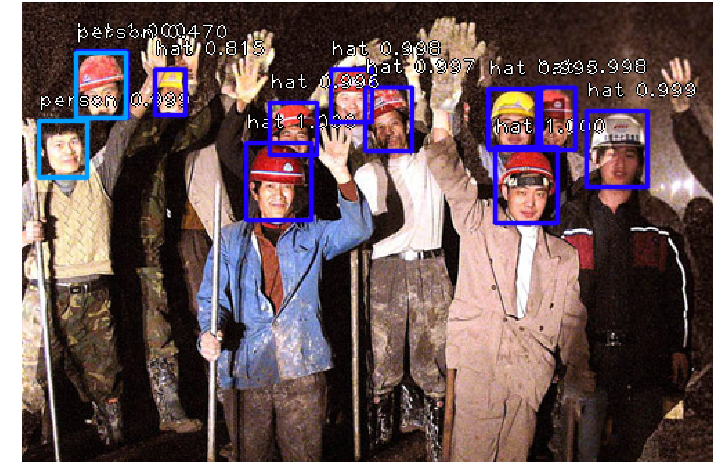
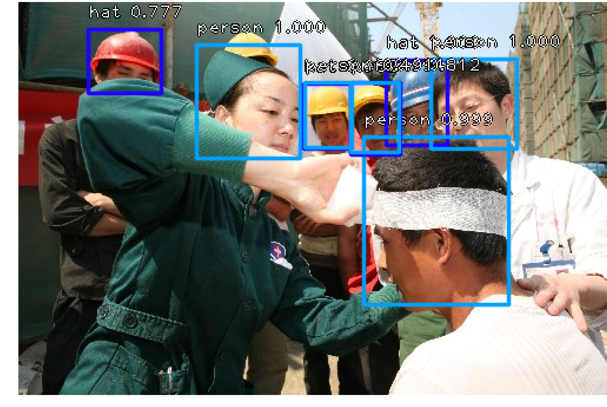
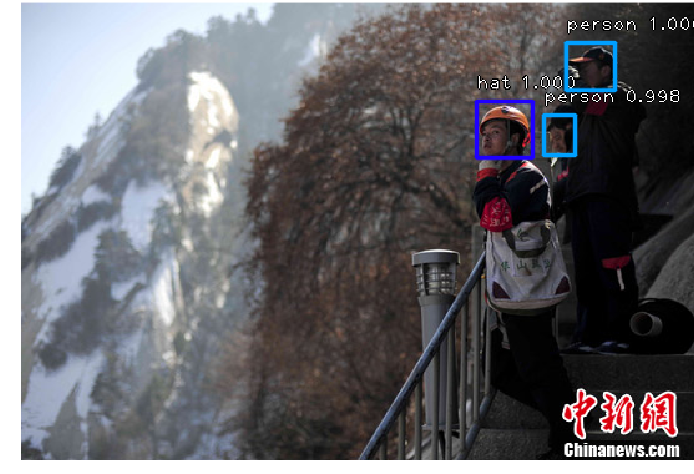
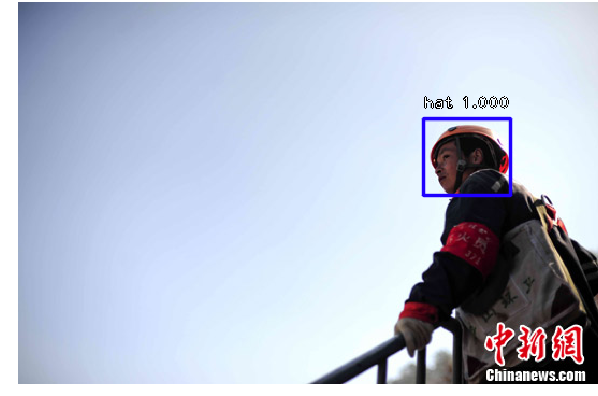
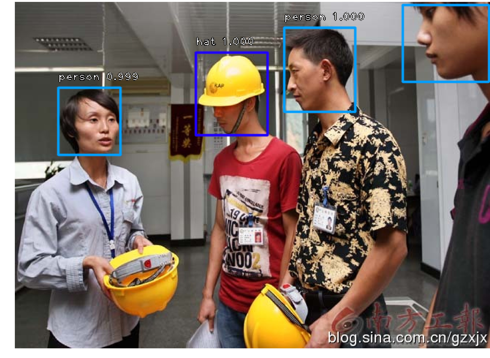

# Keras RetinaNet [](https://travis-ci.org/fizyr/keras-retinanet) [](https://zenodo.org/badge/latestdoi/100249425)

Keras implementation of RetinaNet object detection as described in [Focal Loss for Dense Object Detection](https://arxiv.org/abs/1708.02002)
by Tsung-Yi Lin, Priya Goyal, Ross Girshick, Kaiming He and Piotr Dollár.

## the Keras RetinaNet project is forked from [fizyr](https://github.com/fizyr/keras-retinanet).

## Installation

1) Clone this repository.
2) Ensure numpy is installed using `pip install numpy --user`
3) In the repository, execute `pip install . --user`.
4) Alternatively, you can run the code directly from the cloned  repository, however you need to run `python setup.py build_ext --inplace` to compile Cython code first.

maybe you can refer to my installation file('requirements.txt').


## Testing
An example of testing the network can be seen in [this Notebook](https://github.com/delftrobotics/keras-retinanet/blob/master/examples/ResNet50RetinaNet.ipynb).
In general, inference of the network works as follows:
```python
boxes, scores, labels = model.predict_on_batch(inputs)
```

Where `boxes` are shaped `(None, None, 4)` (for `(x1, y1, x2, y2)`), scores is shaped `(None, None)` (classification score) and labels is shaped `(None, None)` (label corresponding to the score). In all three outputs, the first dimension represents the shape and the second dimension indexes the list of detections.

Loading models can be done in the following manner:
```python
from keras_retinanet.models import load_model
model = load_model('/path/to/model.h5', backbone_name='resnet50')
```

## Predict and test
```
python3 predict.py
```


## Converting a training model to inference model
The training procedure of `keras-retinanet` works with *training models*. These are stripped down versions compared to the *inference model* and only contains the layers necessary for training (regression and classification values). If you wish to do inference on a model (perform object detection on an image), you need to convert the trained model to an inference model. This is done as follows:

```shell
# Running directly from the repository:
keras_retinanet/bin/convert_model.py /path/to/training/model.h5 /path/to/save/inference/model.h5

# Using the installed script:
retinanet-convert-model /path/to/training/model.h5 /path/to/save/inference/model.h5
```

Most scripts (like `retinanet-evaluate`) also support converting on the fly, using the `--convert-model` argument.


## Training
`keras-retinanet` can be trained using [this](https://github.com/fizyr/keras-retinanet/blob/master/keras_retinanet/bin/train.py) script.
Note that the train script uses relative imports since it is inside the `keras_retinanet` package.
If you want to adjust the script for your own use outside of this repository,
you will need to switch it to use absolute imports.

If you installed `keras-retinanet` correctly, the train script will be installed as `retinanet-train`.
However, if you make local modifications to the `keras-retinanet` repository, you should run the script directly from the repository.
That will ensure that your local changes will be used by the train script.

The default backbone is `resnet50`. You can change this using the `--backbone=xxx` argument in the running script.
`xxx` can be one of the backbones in resnet models (`resnet50`, `resnet101`, `resnet152`), mobilenet models (`mobilenet128_1.0`, `mobilenet128_0.75`, `mobilenet160_1.0`, etc), densenet models or vgg models. The different options are defined by each model in their corresponding python scripts (`resnet.py`, `mobilenet.py`, etc).

Trained models can't be used directly for inference. To convert a trained model to an inference model, check [here](https://github.com/fizyr/keras-retinanet#converting-a-training-model-to-inference-model).

### Usage
For training on [Pascal VOC](http://host.robots.ox.ac.uk/pascal/VOC/), run:
```shell
# Running directly from the repository:
keras_retinanet/bin/train.py pascal /path/to/VOCdevkit/VOC2007

# Using the installed script:
retinanet-train pascal /path/to/VOCdevkit/VOC2007
```

For training on a [custom dataset], a CSV file can be used as a way to pass the data.
See below for more details on the format of these CSV files.
To train using your CSV, run:
```shell
# Running directly from the repository:
keras_retinanet/bin/train.py csv /path/to/csv/file/containing/annotations /path/to/csv/file/containing/classes

# Using the installed script:
retinanet-train csv /path/to/csv/file/containing/annotations /path/to/csv/file/containing/classes
```

In general, the steps to train on your own datasets are:
1) Create a model by calling for instance `keras_retinanet.models.backbone('resnet50').retinanet(num_classes=80)` and compile it.
   Empirically, the following compile arguments have been found to work well:
```python
model.compile(
    loss={
        'regression'    : keras_retinanet.losses.smooth_l1(),
        'classification': keras_retinanet.losses.focal()
    },
    optimizer=keras.optimizers.adam(lr=1e-5, clipnorm=0.001)
)
```
2) Create generators for training and testing data (an example is show in [`keras_retinanet.preprocessing.pascal_voc.PascalVocGenerator`](https://github.com/fizyr/keras-retinanet/blob/master/keras_retinanet/preprocessing/pascal_voc.py)).
3) Use `model.fit_generator` to start training.

## Dataset
Train datas come  from [Safety-Helmet-Wearing-Dataset](https://github.com/njvisionpower/Safety-Helmet-Wearing-Dataset).

## Net Struct
.  
.  

## CSV datasets
The `CSVGenerator` provides an easy way to define your own datasets.
It uses two CSV files: one file containing annotations and one file containing a class name to ID mapping.

### Annotations format
The CSV file with annotations should contain one annotation per line.
Images with multiple bounding boxes should use one row per bounding box.
By default the CSV generator will look for images relative to the directory of the annotations file.
A full example:
```
/data/imgs/img_001.jpg,837,346,981,456,person
/data/imgs/img_002.jpg,215,312,279,391,hat
/data/imgs/img_002.jpg,22,5,89,84,hat
/data/imgs/img_003.jpg,,,,,
```
there is a python demo for converting annotations to csv(train.csv val.csv classes.csv).
```
python3 datasets/my_voc_annotation.py

├── classes.csv
├── my_voc_annotation.py
├── voc_train_annotation.csv
└── voc_val_annotation.csv
```

### Class mapping format
The class name to ID mapping file should contain one mapping per line.
Each line should use the following format:
```
hat,0
person,1
```

### Result and show
.  
.  
.  
.
.

## Pretrained models
All models can be downloaded from the [releases page](https://github.com/fizyr/keras-retinanet/releases).